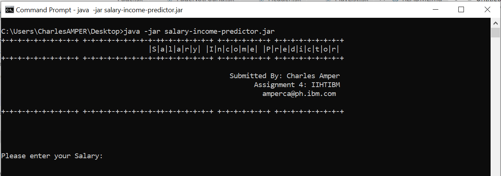
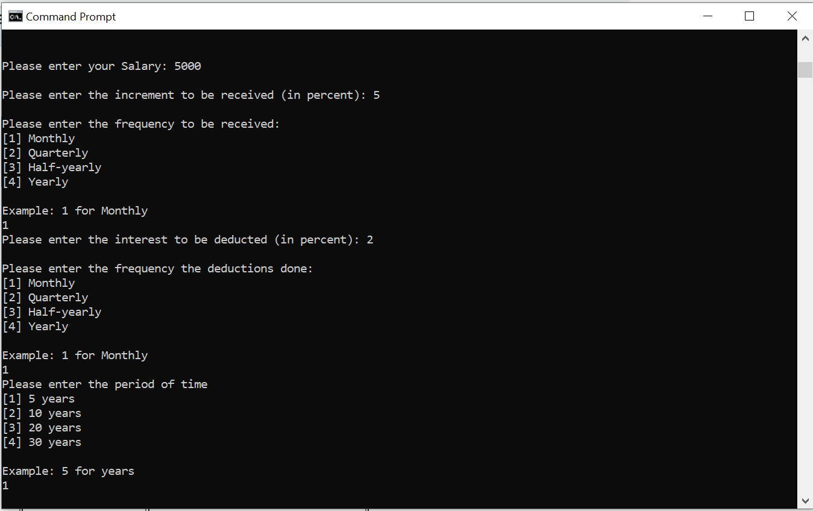
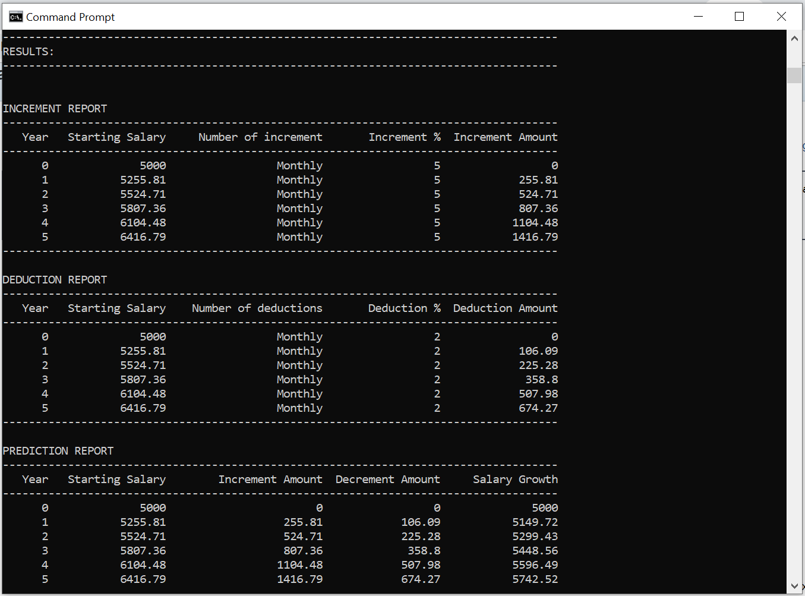

# About

This console app is assignment number 4 for the Full Stack Developer (FSD) course by IIHT and IBM.

## Built With
* [Java 8](https://www.oracle.com/java/)

## Author
* **Charles Amper**

* **Date submitted** : September 25, 2019
* **Training date** : December 2018 - ongoing

## Installation
### Steps

* SalaryIncomePredictor - root app directory

0. Locate the jar file in the root app directory and copy to any folder you want.

1. Open a command prompt.

```
C:\Users\CharlesAMPER\Desktop>
```

2. Go to the directory where the jar is located and run the following command

```
java-jar salary-income-predictor.jar
```
```
C:\Users\CharlesAMPER\Desktop>jave -jar salary-income-predictor.jar
```

## Screenshots

### Banner console


### Input console


### Result console
